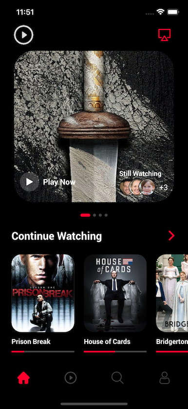

# Movies App

> react native Movie Streaming App

[](https://cdn.dribbble.com/users/2522172/screenshots/14777334/media/07b4f226c700d5557be52e4a449d3e3c.png)

###### Design by [Risang Kuncoro](https://dribbble.com/shots/14777334-Movie-Streaming-App)


## Screenshots
---
#### Home Screen

---


----

## Features
- Movies Feed
- Carrusel with animated dots
- Categories
- Movie details Screen

## Next steps
- Home Screen
- Play Now Screen
- Profile Screen
- Search Component

## Build Setup

```bash
# install dependencies
yarn install

#  install the pods (via Cocoapods) to complete the linking
npx react-native link
npx pod-install ios

# run on ios
npx react-native run-ios
```
